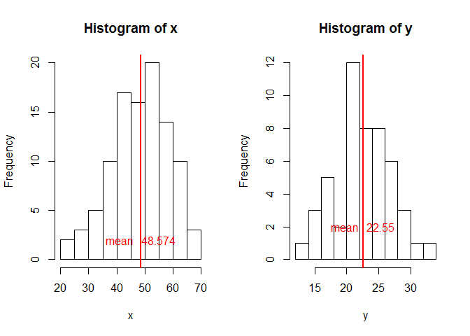
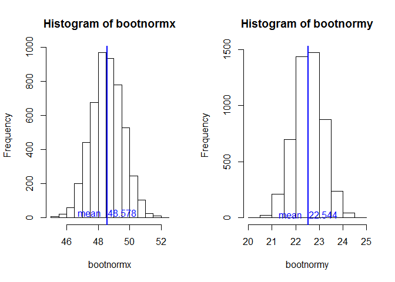
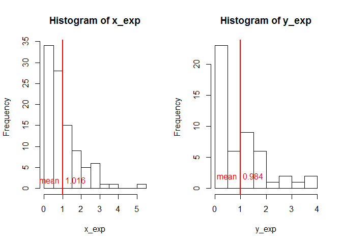
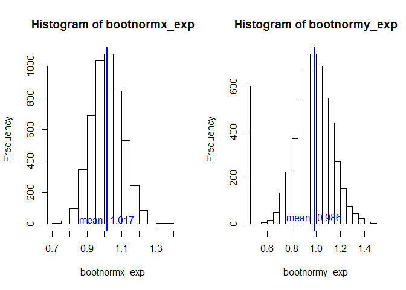

# Bootstrap example to illustrate Central Limit Theorem
Manjula Kottegoda  
June 4, 2016  

***

>#### **The Central limit theorem** states that given a sufficiently large sample size from a population with a finite level of variance; the mean of all samples from the same population will be approximately equal to the mean of the population and will be approximately normally distributed, regardless of the underlying distribution. 

##### The examples and code below illustrates the central limit theorem using R markdown.

## Normal Distribution Example
                                              

Two Random data sets are created using [rnorm](http://www.inside-r.org/r-doc/stats/rnorm). Vector x with 100 values with a mean of 50 and standard deviation of 10; and vector y consisting of 50 values with mean of 22 and standard deviation of 5.


```r
x <- rnorm(100,50,10) # Vector x with 100 values with a mean of 50 and sd 10
y <- rnorm(50,22,5)   # Vector y with 50 values with a mean of 22 and sd 5
mean(x)               # mean of vector x
```

```
## [1] 48.57361
```

```r
mean(y)               # mean of vector y 
```

```
## [1] 22.54962
```

```r
index1 <-5000
bootnormx <- numeric(index1) #numeric vectors defined
bootnormy <- numeric(index1) #numeric vectors defined
#Iteratively fill vector elements with the mean of samples collected from original respective datasets
for (i in 1:index1){bootnormx[i] <- mean(sample(x,100,replace=TRUE))} 
for (i in 1:index1){bootnormy[i] <- mean(sample(y,50,replace=TRUE))}
```

####Histograms of the random normal data sets X and Y show the original underlying distribution.


```r
par(mfrow=c(1,2))                  # Creating 1 row & two columns to show the plots side by side
hist(x)                            # Plot histogram of x
abline(v=mean(x),col="red",lwd=2)  # Draw red line at Mean 
text(mean(x),2, paste("mean ",round(mean(x),digits=3),sep="  "),col ="red") 
hist(y)                            # Plot histogram of y
abline(v=mean(y),col="red",lwd=2)  # Draw red line at Mean 
text(mean(y),2, paste("mean ",round(mean(y),digits=3),sep="  "),col ="red") 
```

<!-- -->


Now we plot the histograms of the means of samples collected from x and y to show that they are normally distributed as well as the mean is very close to the actual mean as stated in CLT.


```r
par(mfrow=c(1,2))
hist(bootnormx)                            # Plot histogram of bootnormx - collection of samples from x
abline(v=mean(bootnormx),col="blue",lwd=2) # Draw blue line at Mean
text(mean(bootnormx),30, paste("mean ",round(mean(bootnormx),digits=3),sep="  "),col ="blue") 
hist(bootnormy)                            # Plot histogram of bootnormy - collection of samples from y
abline(v=mean(bootnormy),col="blue",lwd=2) # Draw blue line at Mean
text(mean(bootnormy),30, paste("mean ",round(mean(bootnormy),digits=3),sep="  "),col ="blue") 
```

<!-- -->


## Exponential Distribution Example

Two Random data sets with exponential distribution are created using [rexp](http://www.inside-r.org/r-doc/stats/rexp) function. Vector x_exp with 100 values and vector y_exp consisting of 50 values.


```r
x_exp <- rexp(100)       # fill vector x_exp with 100 random exponentially distributed values 
y_exp <- rexp(50)        # fill vector y_exp with 50 random exponentially distributed values

mean(x_exp)              # Display mean of x_exp
```

```
## [1] 1.015861
```

```r
mean(y_exp)              # Display mean of y_exp
```

```
## [1] 0.9840112
```

```r
index2 <-5000
bootnormx_exp <- numeric(index2)    #numeric vectors defined for exponential data set sampling
bootnormy_exp <- numeric(index2)    #numeric vectors defined for exponential data set sampling
#Iteratively fill vector elements with the mean of samples collected from  original respective datasets
for (i in 1:index2){bootnormx_exp[i] <- mean(sample(x_exp,100,replace=TRUE))}
for (i in 1:index2){bootnormy_exp[i] <- mean(sample(y_exp,50,replace=TRUE))}
```

Histograms of the random exponential data sets x_exp and y_exp show the underlying exponential distribution.


```r
par(mfrow=c(1,2))
hist(x_exp)
abline(v=mean(x_exp),col="red",lwd=2)  # Draw red line at Mean 
text(mean(x_exp),2, paste("mean ",round(mean(x_exp),digits=3),sep="  "),col ="red") 
hist(y_exp)
abline(v=mean(y_exp),col="red",lwd=2)  # Draw red line at Mean 
text(mean(y_exp),2, paste("mean ",round(mean(y_exp),digits=3),sep="  "),col ="red") 
```

<!-- -->


####Just as before when we plot the histograms of the means of samples collected from x_exp and y_exp we can observe that they are normally distributed. In addition the mean is very close to the actual mean of the original dataset. Both observations are in line with the Central Limit Theorem.


```r
par(mfrow=c(1,2))
hist(bootnormx_exp)                        # Plot histogram of bootnormx_exp - collection of samples from x_exp
abline(v=mean(bootnormx_exp),col="blue",lwd=2) # Draw blue line at Mean
text(mean(bootnormx_exp),30, paste("mean ",round(mean(bootnormx_exp),digits=3),sep="  "),col ="blue") 
hist(bootnormy_exp)                        # Plot histogram of bootnormy_exp - collection of samples from y_exp
abline(v=mean(bootnormy_exp),col="blue",lwd=2) # Draw blue line at Mean
text(mean(bootnormy_exp),30, paste("mean ",round(mean(bootnormy_exp),digits=3),sep="  "),col ="blue") 
```

<!-- -->
